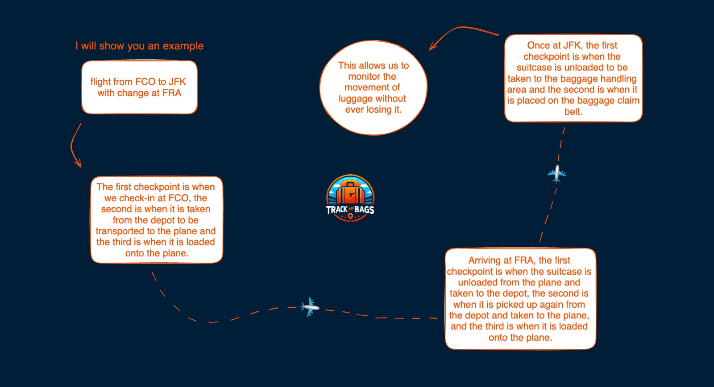

# TRACK my BAGS

Track My Bags is a luggage tracking app designed to simplify and improve the travel experience. With this app, users can monitor the location and status of their luggage in real time throughout their journey. Using advanced technologies, the app provides timely updates on luggage movements, reducing stress and providing peace of mind to travellers.

## Main features

- Real-Time Tracking: View the exact location of your luggage during the journey.
- Travel History: Access a complete record of your past luggage movements.
- Easy Configuration: Quickly connect your luggage to the app through an intuitive configuration process.
- Intuitive User Interface: A clear and intuitive user interface for easy navigation and use.

Facilitate your next trip with Track My Bags, ensuring that you are always in control of your belongings at every stage of your itinerary.



## Technologies imployed

Scaffold: frontend with nextjs and the rich components and hooks by scaffold and wagmi, buildted by buidGuild
HardHat: Great backend for blockchain application, it makes the testing and developer experience an ease

## Requirements
---
Before going through with the installation, you will need:
- Node (>= v18.17)
- Yarn (v1 or v2+)
- Git

## Quick Start
---
To get started with TRACK MY BAGS follow the steps below:
1. Clone the repo && install dependencies:

```
bash
git clone https://github.com/gabref/kugafraga.git
cd kugafraga/scaffold-eth-2
yarn install
```


2. Run a local network on a first terminal:

```
bash
yarn chain
```


3. On a second terminal deploy the test contract:
```
bash
yarn deploy
```


4. On a third terminal start our Next.js app:

```
bash
yarn start
```

Visit our app at `http://localhost:3000`

## ARBITRUM SEPOLIA TEST NET
➜  kugafraga git:(dev-customer) ✗ yarn deploy --network arbitrumSepolia
Nothing to compile
No need to generate any newer typings.
deploying "KGFGTokenFactory" (tx: 0xf4ae857b323b62163d46d6c8b1ceb57fb494ee88ecdfb59aa747b22fa3d168dd)...: deployed at 0x1b29364cc4CC3d866AC6f3cb3eA9a84987e00690 with 26844351 gas
deploying "AirportsManager" (tx: 0x7694f7ba2292f8e753db711b2d86fca18c7310b349a7ee20baff39bc2425f08b)...: deployed at 0x39ecdeb11AF501E87e7dA698C87396e50E5a2b3f with 36293744 gas
📝 Updated TypeScript contract definition file on ../nextjs/contracts/deployedContracts.ts
